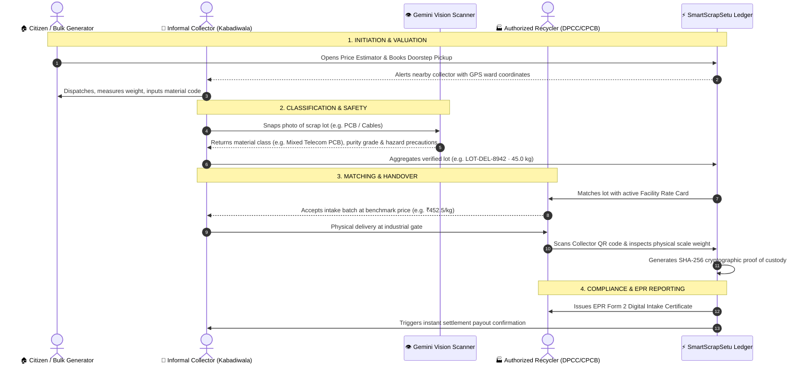
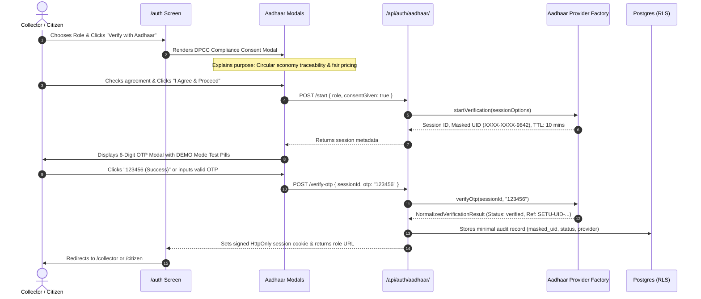

# SmartScrapSetu (स्मार्ट स्क्रैप सेतु)

> **Decentralized Circular Economy Digital Infrastructure for Urban Scrap Valorization & EPR Traceability**

[](https://nextjs.org/)
[](https://react.dev/)
[](https://www.typescriptlang.org/)
[](https://supabase.com/)
[](https://uidai.gov.in/)
[](https://en.wikipedia.org/wiki/Languages_of_India)
[](https://cpcb.nic.in/)
[](https://vercel.com/)

---

## 📌 Executive Summary

India produces over **3.2 million metric tonnes of electronic and urban scrap annually**, yet more than **90% of collection remains trapped within the informal sector** (kabadiwalas, local aggregators, waste pickers). This results in unsafe crude extraction (acid baths, open burning of PVC cables), zero supply chain traceability, volatile unstandardized rates, and severe non-compliance under Central Pollution Control Board (CPCB) Extended Producer Responsibility (EPR) mandates.

**SmartScrapSetu** (*"Bridge for Smart Scrap"*) is an open, resilient digital infrastructure connecting:
1. **Citizens & Bulk Generators**: Instantly book doorstep pickups and discover transparent benchmark pricing.
2. **Informal Waste Collectors**: Access AI-assisted material identification, digital scales, fair market price protection, and worker safety protocols.
3. **Authorized Formal Recyclers**: Source pre-sorted, clean feedstock lots with immutable cryptographic handovers.
4. **Regulators (CPCB / DPCC)**: Monitor end-to-end chain of custody with tamper-evident audit manifests.

---

## 🏛️ System Architecture

SmartScrapSetu is architected as an offline-tolerant, high-performance web platform combining Next.js 16 (App Router), serverless API route handlers, Supabase Postgres with Row Level Security, and Gemini 2.5 Flash Multimodal Vision AI.

```mermaid
flowchart TB
    %% Top Level Styling
    classDef client fill:#eef2ff,stroke:#6366f1,stroke-width:2px;
    classDef engine fill:#f0fdf4,stroke:#22c55e,stroke-width:2px;
    classDef auth fill:#fffbeb,stroke:#f59e0b,stroke-width:2px;
    classDef i18n fill:#fdf4ff,stroke:#d946ef,stroke-width:2px;
    classDef services fill:#f8fafc,stroke:#64748b,stroke-width:2px;

    subgraph ClientLayer["1. Field & Client Experience Layer"]
        CitizenUI["Citizen Workspace<br/>• Doorstep Pickup Booking<br/>• Instant Value Calculator"]:::client
        CollectorUI["Collector Workspace<br/>• AI Scrap Scanner<br/>• Pickups & Schedule<br/>• Earnings & Safety SOPs"]:::client
        RecyclerUI["Recycler Workspace<br/>• Incoming Lots Feedstock<br/>• Custom Rate Cards<br/>• Facility Intake Console"]:::client
        AdminUI["Admin & Regulator Console<br/>• Facility Registry<br/>• Chain-of-Custody Manifests<br/>• EPR Compliance Telemetry"]:::client
    end

    subgraph AppShellEngine["2. Next.js 16 Unified Application Engine"]
        ShellLayout["Role-Aware Navigation Shell (Header, Modals, Ambient Context)"]
        
        subgraph AuthSubsystem["Aadhaar Identity Verification Engine"]
            AadhaarStart["POST /api/auth/aadhaar/start<br/>(Consent & Session Generation)"]:::auth
            AadhaarVerify["POST /api/auth/aadhaar/verify-otp<br/>(OTP Auth & Token Issuance)"]:::auth
            AadhaarStatus["GET /api/auth/aadhaar/status/:id<br/>(Sanitized Status Polling)"]:::auth
            ProviderAbstraction["Aadhaar Provider Interface<br/>(MockProvider ↔ ProdGateway)"]:::auth
            GoogleOAuth["Secondary Fallback: Google OAuth"]:::auth
        end

        subgraph IndicSubsystem["18-Language Indic Multilingual Subsystem"]
            LocaleRegistry["Registry & Meta for 18 Locales"]:::i18n
            RegionalDictionary["Universal UI Regional Dictionary<br/>(850+ Normalized Key Mappings)"]:::i18n
            TranslateResolver["Universal translateKey() with Fallbacks"]:::i18n
            IndicTypography["Unicode Indic Font Fallbacks<br/>(Noto Sans, Nirmala UI, Nastaliq)"]:::i18n
        end

        subgraph FeaturePipelines["Core Operational Pipelines"]
            IntakePipeline["8-Category Scrap Intake Engine"]:::engine
            PriceDiscovery["Delhi Benchmark Rolling Price Board"]:::engine
            HandoverQR["Cryptographic QR Handover Protocol"]:::engine
            ManifestEngine["SHA-256 Telemetry & Audit Engine"]:::engine
        end
    end

    subgraph InfrastructureLayer["3. Cloud & Data Infrastructure"]
        SupabaseDB[("Supabase PostgreSQL Database<br/>• Strict Row Level Security (RLS)<br/>• Identity Verification Registry<br/>• Material Lots & Transactions")]:::services
        SupabaseStorage[("Supabase Object Storage<br/>• Lot Inspection Photos<br/>• Handover Signature Media")]:::services
        GeminiVision["Google Gemini 2.5 Flash Vision API<br/>(Multimodal Scrap Grading & Hazard Detection)"]:::services
    end

    %% Wiring connections
    CitizenUI & CollectorUI & RecyclerUI & AdminUI --> ShellLayout
    ShellLayout --> TranslateResolver
    TranslateResolver --> RegionalDictionary & LocaleRegistry
    TranslateResolver --> IndicTypography

    ShellLayout --> AadhaarStart
    AadhaarStart --> ProviderAbstraction
    AadhaarVerify --> ProviderAbstraction
    AadhaarVerify -. Signed Session Cookie .-> ShellLayout
    ProviderAbstraction -. Zero Raw Aadhaar .-> SupabaseDB

    CollectorUI --> IntakePipeline
    IntakePipeline -. Image Inference .-> GeminiVision
    IntakePipeline --> PriceDiscovery
    IntakePipeline --> HandoverQR
    HandoverQR --> ManifestEngine
    ManifestEngine --> SupabaseDB & SupabaseStorage
```



---

## 🔄 End-to-End Material Journey



---

## 🆔 Aadhaar Identity Verification Subsystem

Rather than relying on arbitrary social logins, SmartScrapSetu integrates a formal identity verification flow that complies with UIDAI regulations, the DPCC Waste Management Charter, and India's Digital Personal Data Protection (DPDP) Act.



### Privacy & Data Minimization Guarantees
* **No Raw Aadhaar Storage**: 12-digit Aadhaar numbers and OTPs are **never saved, written to disk, or logged**.
* **Synthetic Reference Tokens**: Only synthetic verification reference IDs (e.g., `SETU-UID-794218-OKHLA`) and masked previews (`XXXX-XXXX-9842`) are retained.
* **Provider Abstraction**: Decoupled design with an extensible interface (`AadhaarProviderInterface`). Switch effortlessly between `MockAadhaarProvider` (zero-configuration out-of-the-box demo mode) and `ProductionAadhaarProvider` (for live UIDAI / GSTN / Digilocker production gateways).
* **Modular Fallback**: Google OAuth is preserved inside a collapsible drawer for secondary access.

---

## 🌐 18-Language Indian Multilingual Engine

SmartScrapSetu provides a native, accessible multilingual experience supporting **18 Indian languages**, built for high field adoption among informal collectors speaking diverse native languages.

### Comprehensive Supported Languages Matrix

| # | Code | Language | Native Name | Script Family | Layout Flow |
|---|---|---|---|---|---|
| 1 | `en` | English | English | Latin | LTR (Standard) |
| 2 | `hi` | Hindi | हिन्दी | Devanagari | LTR (Standard) |
| 3 | `mr` | Marathi | मराठी | Devanagari | LTR (Standard) |
| 4 | `bn` | Bengali | বাংলা | Bengali-Assamese | LTR (Standard) |
| 5 | `te` | Telugu | తెలుగు | Telugu | LTR (Standard) |
| 6 | `ta` | Tamil | தமிழ் | Tamil | LTR (Standard) |
| 7 | `gu` | Gujarati | ગુજરાતી | Gujarati | LTR (Standard) |
| 8 | `kn` | Kannada | ಕನ್ನಡ | Kannada | LTR (Standard) |
| 9 | `ml` | Malayalam | മലയാളം | Malayalam | LTR (Standard) |
| 10 | `pa` | Punjabi | ਪੰਜਾਬੀ | Gurmukhi | LTR (Standard) |
| 11 | `or` | Odia | ଓଡ଼ିଆ | Odia | LTR (Standard) |
| 12 | `as` | Assamese | অসমীয়া | Bengali-Assamese | LTR (Standard) |
| 13 | `ur` | Urdu | اردو | Perso-Arabic (Nastaliq) | LTR (Standard) |
| 14 | `mai` | Maithili | मैथिली | Devanagari | LTR (Standard) |
| 15 | `ne` | Nepali | नेपाली | Devanagari | LTR (Standard) |
| 16 | `kok` | Konkani | कोंकणी | Devanagari | LTR (Standard) |
| 17 | `sd` | Sindhi | سنڌي | Perso-Arabic (Sindhi) | LTR (Standard) |
| 18 | `dog` | Dogri | डोगरी | Devanagari | LTR (Standard) |

### Key Localization Engineering Decisions
1. **Universal Left-Alignment**: All 18 options in the language selector dropdown align strictly on the left side with native names on the left, English titles adjacent, and checkmarks on the right.
2. **Consistent LTR Flow**: Standard Left-to-Right layout is preserved across all languages (including Urdu and Sindhi), ensuring navigation tabs, buttons, metric cards, and two-column scanners maintain predictable field ergonomic positions.
3. **Universal UI Dictionary (`regional-dictionary.ts`)**: Over 850 normalized string mappings translate every page across the Citizen, Collector, Recycler, Price Board, and Safety views.
4. **Indic Typography Normalization**: Native font-family stacks in `app/globals.css` prioritize `Noto Sans Devanagari`, `Nirmala UI`, `Noto Sans Gurmukhi`, `Noto Sans Tamil`, `Noto Sans Telugu`, and `Noto Nastaliq Urdu`.
5. **Dual Persistence**: Preferences are saved simultaneously in `localStorage` and a lightweight `scrapsetu_language` cookie for instant SSR hydration.

---

## 📦 Standard 8 Material Categories

SmartScrapSetu classifies urban scrap into 8 CPCB-standardized streams:

| Category Code | Material Description | Indicative Benchmark | Common Items & Grades | Hazard Level |
|---|---|---|---|---|
| `PLASTIC` | Plastic (PET / HDPE) | ₹28 / kg | Cold drink bottles, milk pouches, chemical drums | Low |
| `GLASS` | Glass Bottles & Cullet | ₹12 / kg | Beer bottles, soda containers, broken cullet | Low (Cut risk) |
| `PAPER` | Paper & Cardboard (OCC) | ₹18 / kg | Corrugated carton boxes, office kraft paper, duplex | Minimal |
| `METAL_FERROUS` | Ferrous Metal (Iron & Steel) | ₹38 / kg | Construction rebar, scrap sheet iron, automobile frames | Moderate |
| `METAL_NONFERROUS`| Non-Ferrous Metal (Copper/Brass)| ₹420 / kg | Pure copper busbars, heavy brass fittings, aluminum | Moderate |
| `E_WASTE` | E-Waste & Circuit Boards | ₹280 / kg | Populated PC motherboards, phone boards, telecom cards| High (Heavy metals) |
| `TEXTILE` | Textile & Cloth Fabrics | ₹16 / kg | Cotton synthetic clippings, garment scraps | Low |
| `RUBBER_OTHER` | Rubber & Other (Tyres) | ₹14 / kg | Heavy truck tyres, automotive tubes, crumb rubber | Low |

---

## 📁 Repository Structure

```text
smart-scrap-v2/
├── app/                                 # Next.js 16 App Router and global presentation
│   ├── admin/                           # Governance & CPCB compliance portal
│   ├── api/auth/aadhaar/                # Aadhaar identity verification endpoints (start, verify-otp, status)
│   ├── auth/                            # Identity verification gateway & role selection
│   ├── citizen/                         # Citizen doorstep pickup booking & price estimator
│   ├── collector/                       # Informal collector portal (scanner, pickups, earnings)
│   ├── recycler/                        # Recycler intake hub, rate cards, and matching queue
│   ├── globals.css                      # Master design tokens & Indic typography fallbacks
│   └── layout.tsx                       # Root layout wrapping Universal LanguageProvider
├── components/                          # Modular React 19 UI component system
│   ├── admin/                           # Governance audit consoles & facility metrics
│   ├── auth/                            # Aadhaar consent modal, OTP verification, and auth cards
│   ├── citizen/                         # Citizen pickup workflows & instant price calculator
│   ├── collector/                       # Collector workspace composition & metric cards
│   ├── landing/                         # Cinematic intro, hero banner, and circular economy loop
│   ├── language/                        # Accessible 18-Language switcher, Provider, and T component
│   ├── material-flow/                   # Interactive circular supply chain diagrams
│   ├── recycler/                        # Incoming lots feed, facility overview, and rate cards
│   ├── shell/                           # Shared role-aware navigation header & user pills
│   └── ui/                              # Reusable accessible interface primitives & badges
├── features/                            # Domain-specific feature modules
│   ├── collector/                       # AI Scrap Scanner, schedule management, and earnings
│   ├── customer-pickup/                 # Doorstep pickup booking workflow
│   ├── handover/                        # Cryptographic QR code handovers & chain of custody
│   ├── pickups/                         # Shared citizen/collector request workflows
│   ├── price-board/                     # Delhi 7-day rolling industrial benchmark price board
│   ├── recycler/                        # Lot matching algorithm & facility intake queue
│   └── safety/                          # Worker safety guides & CPCB e-waste hazard SOPs
├── lib/                                 # Core services, providers, and domain logic
│   ├── auth/aadhaar/                    # Aadhaar provider abstraction (Mock & Production gateways)
│   ├── language/locales/                # 18-Language schemas, registry, and regional-dictionary
│   ├── mock-data.ts                     # Pre-seeded lots, recyclers, and benchmark pricing
│   └── supabase.ts                      # Supabase client singleton & authentication helpers
├── supabase/migrations/                 # Declarative PostgreSQL schema migrations
│   ├── 20260908184000_core_schema.sql   # Core tables: lots, lot_matches, rate_cards, transactions
│   └── 20260909000000_identity_verification.sql # Tokenized identity verification registry & RLS
├── types/                               # TypeScript domain definitions & Supabase schema types
│   ├── database.ts                      # Generated Supabase database interface
│   └── domain.ts                        # Material categories, user roles, lot states, and handover models
├── scripts/                             # Utility & infrastructure scripts
│   └── setup-storage-buckets.js         # Automated Supabase storage bucket provisioning
├── main/                                # Microservice & synchronized web mirror
│   ├── api/                             # Python FastAPI / Gemini multimodal vision microservice
│   └── web/                             # Synced web application source package
├── public/                              # Static media assets, icons, and circular economy video
├── package.json                         # Next.js 16, React 19, Lucide, Supabase, TypeScript dependencies
├── tsconfig.json                        # Strict TypeScript compiler configuration
└── vercel.json                          # Vercel deployment configuration (Mumbai bom1 region)
```

---

## ⚡ Getting Started

### Prerequisites
* **Node.js**: `v20.x` or `v22.x` (LTS)
* **npm**: `v10.x` or higher
* **Modern Web Browser**: Chrome, Edge, Firefox, or Safari

### Installation & Local Setup

```bash
# 1. Clone the repository
git clone https://github.com/Yash3211/smart-scrap-v2.git
cd smart-scrap-v2

# 2. Checkout the backend branch
git checkout backend

# 3. Install dependencies
npm install

# 4. Launch development server
npm run dev
```

Visit **[http://localhost:3000](http://localhost:3000)** in your browser.

The platform runs out of the box with zero setup. Open `/auth` and select any persona or authenticate with Aadhaar demo mode to explore each workspace.

---

## 🧪 Testing the Identity Verification Flow

1. Open **[http://localhost:3000/auth](http://localhost:3000/auth)**.
2. Pick a role (**Collector** or **Citizen**).
3. Test the language switcher in the header or on the card to see the interface instantly translate into Hindi, Marathi, Bengali, Tamil, Urdu, etc.
4. Click **"Verify with Aadhaar"**.
5. Read the DPCC compliance and data minimization consent note, then click **"I Agree & Proceed"**.
6. The OTP modal appears with a clear **`DEMO MODE`** indicator:
   - Click the **`123456 (Success)`** pill to autofill the valid simulated code.
   - Click **"Submit OTP & Verify"**.
7. The animated verification spinner executes and you are instantly redirected to your authenticated workspace (`/collector` or `/citizen`).

---

## 🛡️ Code Quality & Verification

```bash
# Validate strict TypeScript compilation (Zero Errors)
npx tsc --noEmit

# Build production bundle
npm run build
```

---

## 📜 Compliance & Mission

SmartScrapSetu is developed under the **Digital India Circular Economy Initiative**, aligning with:
* **E-Waste (Management) Rules, 2022** (CPCB)
* **Battery Waste Management Rules, 2022**
* **Plastic Waste Management Rules, 2016**
* **Delhi Pollution Control Committee (DPCC) Guidelines** for informal sector integration.

Designed to turn scrap collection into a transparent, safe, and dignified green livelihood.
