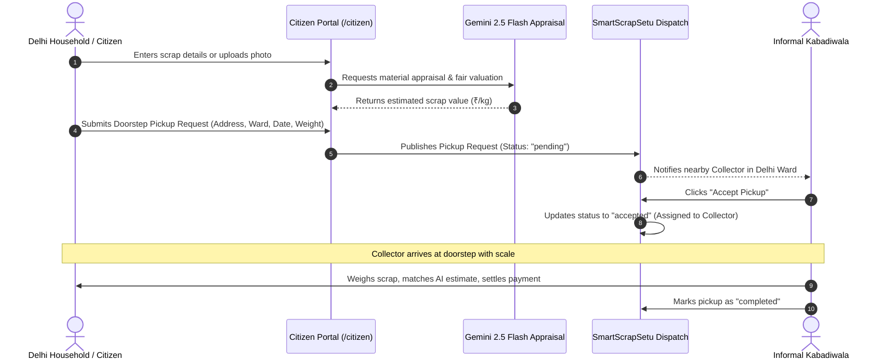
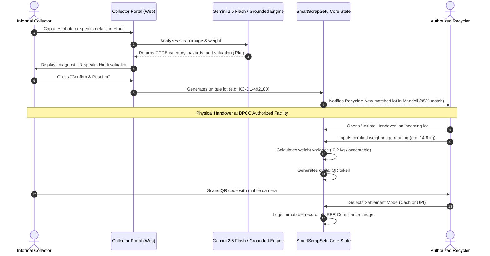

# SmartScrapSetu (Kabadiwala Connect)
### Bridging Informal E-Waste Collectors into the Formal, Traceable Value Chain

**GitHub Repository:** [https://github.com/nikhillakra2007-tech/SmartScrapSetu](https://github.com/nikhillakra2007-tech/SmartScrapSetu)  


> **Pilot Geography**: National Capital Territory (NCT) of Delhi (*Mandoli/Shahdara, Okhla, Patparganj, Peeragarhi, Mohan Cooperative*)  
> **Regulatory Alignment**: E-Waste (Management) Rules, 2022 & CPCB/DPCC EPR Guidelines  
> **Database**: Supabase PostgreSQL with PostGIS Spatial Extensions & Row Level Security (RLS)  
> **Primary Scrap Taxonomy**: 8 Top-Level Material Groups & 8 E-Waste Parent Subfamilies (50 Canonical Subcategories)  
> **Design Theme**: LeafLine Soothing Ivory & Deep Pine Sustainability Palette

---

## 📑 Table of Contents

1. [Executive Summary & Problem Statement](#-executive-summary--problem-statement)
2. [Quad-Persona System Architecture](#-quad-persona-system-architecture)
   - [2.1 Public Front Door & Live Flow Simulator (/)](#21-public-front-door--)
   - [2.2 Citizen Scrap Valuation & Doorstep Pickup Portal (/citizen)](#22-citizen-scrap-valuation--doorstep-pickup-portal-citizen)
   - [2.3 Dedicated Field Collector Workspace (/collector)](#23-dedicated-field-collector-workspace-collector)
   - [2.4 DPCC Authorized Recycler Command Center (/recycler)](#24-dpcc-authorized-recycler-command-center-recycler)
   - [2.5 DPCC Platform Administrator Console (/admin)](#25-dpcc-platform-administrator-console-admin)
   - [2.6 Setu Delhi Civic Assistant](#26-setu-delhi-civic-assistant)
3. [AI Classification & Multimodal Vision Models](#-ai-classification--multimodal-vision-models)
   - [3.1 Google Gemini 2.5 Flash Multimodal Vision](#31-google-gemini-25-flash-multimodal-vision)
   - [3.2 Grounded Delhi Material Classification Engine](#32-grounded-delhi-material-classification-engine)
   - [3.3 2-Way Vernacular Voice Assistant (Hindi STT & TTS)](#33-2-way-vernacular-voice-assistant-hindi-stt--tts)
4. [Design System & UI Experience](#-design-system--ui-experience)
   - [4.1 LeafLine Organic Color Palette & Brand Consistency](#41-leafline-organic-color-palette--brand-consistency)
   - [4.2 Modern Top-Nav Application Shell (AppShell.tsx)](#42-modern-top-nav-application-shell-appshelltsx)
   - [4.3 Systematic 1–2 File Component Architecture](#43-systematic-12-file-component-architecture)
   - [4.4 Workable "+ Create New Lot" Intake Modal](#44-workable--create-new-lot-intake-modal)
   - [4.5 Responsive Mobile Experience](#45-responsive-mobile-experience)
5. [Complete Repository & Folder Structure](#-complete-repository--folder-structure)
6. [Detailed User & Data Flows](#-detailed-user--data-flows)
   - [6.1 Citizen Doorstep Collection to Collector Handshake](#61-citizen-doorstep-collection-to-collector-handshake)
   - [6.2 Collector to Recycler End-to-End Workflow](#62-collector-to-recycler-end-to-end-workflow)
7. [Database Schema & PostGIS Geo-Matching](#-database-schema--postgis-geo-matching)
8. [Local Setup & Running Instructions](#-local-setup--running-instructions)
9. [Environment Variables Reference](#-environment-variables-reference)
10. [Roadmap & Scale Vision](#-roadmap--scale-vision)

---

## 🌍 Executive Summary & Problem Statement

### The Problem
Over **95% of India's e-waste** is collected by the informal sector—local *kabadiwalas*, waste-pickers, and micro-aggregators. While they have unparalleled doorstep collection reach across Indian cities, they operate completely disconnected from the formal recycling ecosystem mandated by India's **E-Waste (Management) Rules, 2022**:

1. **Price Exploitation & Information Asymmetry**: Middlemen depress scrap rates arbitrarily without market transparency, cheating both everyday citizens and collectors.
2. **Hazardous Backyard Processing**: Lacking formal dockets, informal aggregators engage in acid-leaching, open cable burning, and circuit board heating to extract copper and precious metals, causing catastrophic pollution and mineral loss.
3. **Broken EPR Compliance**: Transactions remain undocumented, preventing formal dismantlers from claiming Extended Producer Responsibility (**EPR**) credits and leaving citizens with no reliable recycling channels.

### The Solution: SmartScrapSetu
**SmartScrapSetu** bridges this gap by connecting citizens, informal collectors, authorized recyclers, and state pollution regulators into a unified, traceable value chain:
- **Citizen Empowerment**: Instant scrap appraisal ("Know your scrap's worth") and verified doorstep pickup booking.
- **Multimodal AI Vision**: Instant CPCB category classification, physical condition evaluation, hazard flagging, and fair Delhi benchmark valuation.
- **Role-Segregated Quad Workspaces**: Dedicated, clutter-free interfaces for Citizens, Collectors, Recyclers, and Admins.
- **Vernacular Audio Assistance**: 2-way Hindi Speech Recognition (`STT`) and Voice Readout (`TTS`) designed for low-literacy operators.
- **Deterministic Recycler Matching**: Pairs scrap lots with authorized dismantlers based on PostGIS geographic proximity, material acceptance, and rate cards.
- **Tamper-Evident QR Traceability**: Certified weighbridge recordings, discrepancy checks, and unique human-readable transaction tokens (`KC-DL-XXXXXX`) establish full chain-of-custody compliance.

---

## 👥 Quad-Persona System Architecture

SmartScrapSetu separates the public entry point from authenticated, role-tailored operational workspaces:

```
                                  ┌────────────────────────────────┐
                                  │       Public Landing Page      │
                                  │            (Route: /)          │
                                  └───────────────┬────────────────┘
                                                  │
                                                  ▼
                                  ┌────────────────────────────────┐
                                  │     Authentication Gateway     │
                                  │         (Route: /auth)         │
                                  │  (Google Demo Accounts & Auth) │
                                  └───────────────┬────────────────┘
                                                  │ Role-Based Redirection
            ┌───────────────────────────┬─────────┴─────────────────┬───────────────────────────┐
            ▼                           ▼                           ▼                           ▼
   [ CITIZEN PORTAL ]          [ COLLECTOR APP ]           [ RECYCLER PORTAL ]         [ ADMIN CONSOLE ]
      ( /citizen )              ( /collector )                ( /recycler )               ( /admin )
🔍 "Know Scrap's Worth"       ⚡ AI Scanner & Scale        📊 Facility Command Hub     🛡️ DPCC Regulatory Hub
💰 Instant AI Valuation       📈 Live Price Board          📥 Incoming Lots Queue      🏭 Authorized Facility Registry
🚚 Doorstep Pickup Booking    ⚠️ Worker Safety Directives  🛡️ Handover & QR Scale      📋 Digital Audit Manifests
📍 Delhi Ward Dispatch        🚚 Citizen Pickups Dispatch  💳 Rate Card Manager (₹)    🚪 Single-Click Logout
```

### 2.1 Public Front Door (`/`)
- **Public Landing Page** ([`LandingPage.tsx`](file:///main/web/components/landing/LandingPage.tsx)): Modern, green, high-contrast entry point introducing SmartScrapSetu's purpose, capabilities, and regulatory alignment.
- **Interactive Live Flow Simulator**: Real-time interactive scrap category picker (Telecom PCB, End-of-Life Phones, Stripped Copper, Server Chassis) allowing visitors to test AI inspection, recycler pricing, and QR handover verification.
- **Spotlight Focus Interaction**: Interactive grid transitions that gently soften siblings on hover, drawing clean visual focus to active capability cards.
- **Lenis Inertial Scrolling**: Smooth-scroll anchor jumps between sections (*What It Does*, *How It Works*, *Why It Matters*).

### 2.2 Citizen Scrap Valuation & Doorstep Pickup Portal (`/citizen`)
- **"Know your scrap’s worth" AI Valuation Engine**:
  - Citizens can upload or capture photos of household electronic items (old phones, dead laptops, circuit boards, cables, CRT screens, batteries, home appliances).
  - Powered by Gemini 2.5 Flash and local Delhi rate cards to give households an instant, fair scrap value before calling a scrap dealer.
  - Transparent price breakdown prevents local middlemen from lowballing citizens.
- **Doorstep Pickup Booking System** ([`Pickups.tsx`](file:///main/web/features/pickups/Pickups.tsx) & [`CustomerPickupPortal.tsx`](file:///main/web/features/customer-pickup/CustomerPickupPortal.tsx)):
  - **Pickup Address & Delhi Ward**: Accurate address input and ward selection covering Delhi NCT (Mandoli, Okhla, Mayapuri, Patparganj, Peeragarhi, Mohan Cooperative, etc.).
  - **Material & Weight Details**: Citizens specify material category, approximate weight in kg, contact phone number, and preferred date/time slot.
  - **Live Dispatch to Verified Collectors**: Once requested, pickups are instantly visible to authorized informal collectors operating within that specific Delhi ward.
  - **Lifecycle Tracking**: Requests update through `pending` (awaiting collector) $\to$ `accepted` (assigned to local collector) $\to$ `completed` (weighed & paid).
  - **Multi-Role Browser Sync**: Doorstep requests broadcast live across browser sessions via custom event buses and local storage, enabling seamless multi-persona demonstrations.

### 2.3 Dedicated Field Collector Workspace (`/collector`)
- **AI Scrap Scanner** ([`CollectorPortal.tsx`](file:///main/web/features/collector/CollectorPortal.tsx)): Camera photo capture, image drag-and-drop, clipboard paste (`Ctrl+V`), and sample presets. Real-time Gemini 2.5 Flash classification.
- **Physical Scale Input**: Enter lot weight in kilograms with instant value calculation.
- **Category Quick Override Pills**: Instant one-tap inspection across PCB, Battery, Cable, CRT, Display, Motor, Metal Scrap, and Whole Devices.
- **Live Price Board** ([`LivePriceBoard.tsx`](file:///main/web/features/price-board/LivePriceBoard.tsx)): 7-day rolling Delhi market benchmarks with high/low spreads and Hindi audio readouts.
- **Worker Safety Guides** ([`SafetyGuidanceView.tsx`](file:///main/web/features/safety/SafetyGuidanceView.tsx)): Pictorial hazard directives for handling swollen lithium-ion cells, leaded CRT glass, and open wire burning.
- **Citizen Doorstep Pickups**: In-app pickup inbox where collectors view pending citizen bookings in their ward, accept jobs, navigate to pickup locations, and complete doorstep collection.

### 2.4 DPCC Authorized Recycler Command Center (`/recycler`)
- **Command Hub** ([`RecyclerOverview.tsx`](file:///main/web/features/recycler/RecyclerOverview.tsx)): Daily procurement KPIs, incoming candidate lots, and DPCC EPR compliance status.
- **Incoming Lots Queue** ([`MatchedLotsQueue.tsx`](file:///main/web/features/recycler/MatchedLotsQueue.tsx)): Review offered scrap lots, AI confidence, hazard flags, and geographic proximity score before accepting.
- **Handover & QR Scale Verification** ([`HandoverVerificationModal.tsx`](file:///main/web/features/handover/HandoverVerificationModal.tsx) & [`HandoverTraceabilityView.tsx`](file:///main/web/features/handover/HandoverTraceabilityView.tsx)): Weighbridge verification, variance calculation against declared weight, unique digital QR code generation, and immutable audit ledger.
- **Rate Card Manager** ([`RateCardManager.tsx`](file:///main/web/features/recycler/RateCardManager.tsx)): Live configuration of procurement pricing per kg across all canonical scrap categories.

### 2.5 DPCC Platform Administrator Console (`/admin`)
- **Regulatory Oversight** ([`AdminWorkspace.tsx`](file:///main/web/components/admin/AdminWorkspace.tsx)): Dedicated console for DPCC platform regulators (*Priya Verma*).
- **Authorized Facilities Registry**: Audited registry of DPCC-approved recycling units across Okhla, Mayapuri, Bawana, and Narela.
- **Digital Handover Audit Manifests**: Real-time compliance ledger recording dual-party cryptographic QR transfers and certified scale weights.

### 2.6 Setu Delhi Civic Assistant
- **Floating Civic Support** ([`SetuAssistant.tsx`](file:///main/web/components/SetuAssistant/SetuAssistant.tsx)): Floating assistant that transforms into an 80vh bottom sheet on mobile screens with isolated scrolling (`overscroll-behavior: contain`), preventing page interference. Answers citizen and collector inquiries regarding Delhi e-waste rates, doorstep pickup bookings, and hazardous material safety.

---

## 🤖 AI Classification & Multimodal Vision Models

SmartScrapSetu features a dual-engine architecture to guarantee reliable, instantaneous, and deterministic scrap classification in any environment:

```
                            [ Scrap Image Input ]
                                      │
                 ┌────────────────────┴────────────────────┐
                 ▼                                         ▼
   [ Live Google Gemini 2.5 Flash ]          [ Grounded Delhi Pilot Engine ]
   • Direct REST Call / API Key              • Canvas Color & Luminance Sampler
   • Strict CPCB Taxonomy JSON               • Delhi 7-Day Rolling Benchmark Matrix
   • Component Identification                • Scale-Weighted Payout Calculation
                 │                                         │
                 └────────────────────┬────────────────────┘
                                      ▼
                        [ Structured Classification ]
                        • CPCB Category & Sub-Code
                        • Physical Condition (Intact / Scrap)
                        • Hazard Flags (Lithium / Leaded / Acid)
                        • Suggested Rate (₹/kg) & Lot Valuation
```

### 3.1 Google Gemini 2.5 Flash Multimodal Vision
- **Live Google API Drawer**: Collectors and evaluators can connect their Google Gemini API key directly in the web UI.
- **Structured Schema**: Calls Gemini 2.5 Flash with structured JSON output enforcing CPCB taxonomy:
  - `parent_code`, `sub_code`, `condition`, `category_confidence`, `hazard_flags`, `is_hazardous`, `suggested_rate_per_kg`, `identified_components`, and `ai_notes`.
- **Python Microservice** ([`main/api/gemini_service.py`](file:///main/api/gemini_service.py)): FastAPI endpoint `/api/classify-image-upload` providing backend verification for high-throughput batch classification.

### 3.2 Grounded Delhi Material Classification Engine
- **Zero-Dependency Fallback**: If an API key is not entered or if the network is offline, the grounded Delhi engine automatically activates.
- **Canvas Pixel Color Sampling**: Analyzes image luminance and dominant color spectrum on a 32×32 canvas (e.g., green PCB detection, copper red cable identification, dark lithium-ion casing detection).
- **CPCB Category Profiles**: High-affinity matching across 8 core e-waste types with dynamic confidence and live Delhi benchmark rates.

### 3.3 2-Way Vernacular Voice Assistant (Hindi STT & TTS)
- **Hindi Speech Recognition (`STT`)**: Collectors tap the microphone button (`बोलकर बताएं 🎙️`) and describe scrap in Hindi or Hinglish (e.g., *"10 kilo copper wire Okhla"* or *"पंद्रह किलो तांबा"*). The engine transcribes speech, extracts material category, weight, and Delhi ward, and triggers inspection automatically.
- **Hindi Speech Synthesis (`TTS`)**: Tapping the speaker button (`बोलकर सुनें 🔊`) reads out the classified material and total fair payout in clear Hindi audio.

---

## 🎨 Design System & UI Experience

### 4.1 LeafLine Organic Color Palette & Brand Consistency
Inspired by the calm, grounded aesthetic of [LeafLine Ivory](https://leaf-line-ivory.vercel.app/), SmartScrapSetu eliminates bright white glare and eye strain:
- **Canvas Background**: Warm Leaf Ivory / Off-White (`#F6F8F5` / `#FAF8EE`)
- **Primary Brand Color**: Deep Pine / Bangladesh Green (`#087F5B` / `#005F52`)
- **Accent Indicator**: Caribbean Emerald (`#10B981` / `#1CC596`)
- **Surfaces**: Crisp White Cards (`#FFFFFF`) with organic borders (`#DCE5E0` / `#E2DDD0`)
- **Typography**: Rich Dark Charcoal (`#0B1220`) for headers, Muted Slate (`#52606D`) for body copy
- **Universal Brand Iconography**: A consistent emerald/green rounded badge featuring the **Recycle** icon (`strokeWidth={2.4}`) across the public landing page, authentication gateway, and authenticated workspaces.

### 4.2 Modern Top-Nav Application Shell (`AppShell.tsx`)
- **Full-Width Header**: Clean, responsive top navigation bar with sticky positioning, backdrop blur (`14px`), and role indicators.
- **Centered Golden-Ratio Content**: Workspace content is gracefully centered in a high-readability container (`max-width: 1360px`) with balanced padding across desktop, tablet, and mobile viewports.
- **Interactive Notification Center**: Real-time operational alerts popover with unread counters, notification categories (lots matched, bids submitted, compliance alerts), and single-click "Mark all as read".
- **One-Click Role Switching**: Integrated role tabs allowing instant switching between Citizen, Collector, Recycler, and Admin perspectives during demonstrations.

### 4.3 Systematic 1–2 File Component Architecture
- **Dedicated Folder per Component**: Every UI component lives in its own dedicated folder containing only 1 or 2 files (e.g., `Component.tsx` + `Component.module.css` and a clean `index.ts` re-export).
- **Zero Monoliths**: Eliminates cluttered directories, ensures rapid navigation, and makes isolated style tweaks painless.

### 4.4 Workable "+ Create New Lot" Intake Modal
- **Live AI Valuation**: Selecting material presets (PCB, Lithium Batteries, Stripped Copper, CRT Glass) and entering weight calculates instant payout valuations.
- **Zero Scroll Leak**: Employs strict background scroll locking (`document.body.style.overflow = 'hidden'`), containerized modal scrolling, and `data-lenis-prevent="true"` with event propagation stops to guarantee that background pages never scroll when interacting with modal forms.
- **Instant Queue Updates**: Submitting a new lot immediately generates a verified tracking identifier (`LOT-DEL-XXX`) and prepends it directly into the active matched lots queue with success feedback.

### 4.5 Responsive Mobile Experience
- **Adaptive Stacking**: Metrics grids, operational action headers, and section switcher cards smoothly collapse from multi-column grids to clean vertical cards on mobile screens ($\le 640\text{px}$).
- **Touch-Optimized Touch Targets**: Touch targets meet or exceed 44px with comfortable padding and scroll-isolated bottom drawer support.
- **No Clutter or Horizontal Overflows**: All tables and cards are bounded with containerized overflow handling and responsive typography.

---

## 📁 Complete Repository & Folder Structure

All frontend components adhere to a strict **1–2 files per folder** modular convention:

```
SmartScrapSetu/
├── README.md                                  # Master Platform Documentation
└── main/                                      # Application Root
    ├── api/                                   # Python AI Microservice (FastAPI)
    │   ├── requirements.txt                   # FastAPI, google-genai, supabase, uvicorn
    │   ├── main.py                            # FastAPI entrypoint & classification endpoints
    │   ├── gemini_service.py                  # Gemini 2.5 Flash multimodal vision pipeline
    │   ├── taxonomy_data.py                   # 11 CPCB categories & Delhi pilot rate benchmarks
    │   ├── check_models.py                    # Script auditing active Google GenAI models
    │   └── test_live_vision.py                # Synthetic testing pipeline
    │
    └── web/                                   # Next.js 15 Web Platform (App Router)
        ├── package.json                       # Next.js 15, React 19, TypeScript, Lucide, Lenis
        ├── next.config.ts                     # Next.js configuration
        ├── tsconfig.json                      # Strict TypeScript compiler options
        │
        ├── app/                               # Next.js App Router (Clean 1-page routes)
        │   ├── layout.tsx                     # Root shell & SEO metadata
        │   ├── page.tsx                       # Public Landing Page route
        │   ├── auth/page.tsx                  # Standalone Authentication route
        │   ├── citizen/page.tsx               # Citizen Scrap Valuation & Pickup route
        │   ├── collector/page.tsx             # Field Collector Portal route
        │   ├── recycler/page.tsx              # Authorized Recycler Command Hub route
        │   ├── admin/page.tsx                 # DPCC Platform Admin Console route
        │   └── globals.css                    # Design tokens & global resets
        │
        ├── components/                        # Feature-First Modular Components (1-2 files/folder)
        │   ├── landing/LandingPage/           # LandingPage.tsx, LandingPage.module.css
        │   ├── citizen/CitizenWorkspace/      # CitizenWorkspace.tsx, CitizenWorkspace.module.css
        │   ├── collector/CollectorWorkspace/  # CollectorWorkspace.tsx, CollectorWorkspace.module.css
        │   ├── recycler/RecyclerWorkspace/    # RecyclerWorkspace.tsx, RecyclerWorkspace.module.css
        │   ├── admin/AdminWorkspace/          # AdminWorkspace.tsx, AdminWorkspace.module.css
        │   ├── auth/AuthPage/                 # AuthPage.tsx, AuthPage.module.css
        │   ├── shell/
        │   │   ├── AppShell/                  # AppShell.tsx, AppShell.module.css
        │   │   ├── Header/                    # Header.tsx, Header.module.css
        │   │   ├── Sidebar/                   # Sidebar.tsx, Sidebar.module.css
        │   │   └── MobileNav/                 # MobileNav.tsx, MobileNav.module.css
        │   ├── language/Language/             # Vernacular i18n translator (Hindi/English)
        │   ├── material-flow/MaterialFlow/    # Interactive supply chain flow visualizer
        │   ├── SetuAssistant/                 # SetuAssistant.tsx, SetuAssistant.module.css
        │   ├── SmoothScroll/                  # SmoothScroll.tsx (Lenis inertial scrolling)
        │   └── ui/                            # Clean Reusable UI Primitives (1-2 files each)
        │       ├── Badge/                     # Badge.tsx, Badge.module.css
        │       ├── Button/                    # Button.tsx, Button.module.css
        │       ├── Card/                      # Card.tsx, Card.module.css
        │       └── Modal/                     # Modal.tsx, Modal.module.css
        │
        ├── features/                          # Core Domain Features
        │   ├── collector/                     # CollectorPortal & AI vision inputs
        │   ├── recycler/                      # RecyclerOverview & rate card manager
        │   ├── handover/                      # QR code & weighbridge verification
        │   ├── price-board/                   # Live Delhi benchmark rates
        │   ├── safety/                        # Pictorial worker safety guides
        │   ├── pickups/                       # Doorstep pickup booking & collector status
        │   └── customer-pickup/               # Citizen pickup scheduling & estimate calculator
        │
        ├── lib/                               # Infrastructure Clients & Mock Data
        │   ├── supabase.ts                    # Supabase client with live cloud & sandbox fallback
        │   └── mock-data.ts                   # Delhi pilot verified mock dataset
        │
        └── types/                             # TypeScript Definitions
            └── database.ts                    # Strongly-typed database & domain interfaces
```

---

## 🔄 Detailed User & Data Flows

### 6.1 Citizen Doorstep Collection to Collector Handshake



### 6.2 Collector to Recycler End-to-End Workflow



---

## 🗄 Database Schema & PostGIS Geo-Matching

SmartScrapSetu is powered by a production-grade Supabase PostgreSQL instance (`hdlynafbuybvjbdcftjb`) configured with:
- **`lots`**: Stores collector-submitted scrap lots, declared weight, AI suggested rate, estimated value, hazard tags, and status (`draft`, `matched`, `accepted`, `delivered`).
- **`lot_matches`**: Pairs lots with recyclers using a composite score calculated from:
  $$\text{Match Score} = (0.40 \times \text{Geo Proximity}) + (0.30 \times \text{Category Match}) + (0.30 \times \text{Price Spread})$$
- **`fn_match_recyclers_for_lot`**: PostGIS spatial stored procedure matching scrap batches with recyclers based on geodetic distance ($ST\_DWithin$) and category acceptance.
- **`handover_records`**: Captures certified scale weights, discrepancies, human-readable reference tokens (`KC-DL-XXXXXX`), and timestamped chain-of-custody.
- **`recycler_rate_cards`**: Recycler-configured procurement price per kg across all 50 canonical subcategories.
- **`customer_pickup_requests`**: Citizen doorstep bookings with fair price estimation and Delhi ward routing.

---

## 💻 Local Setup & Running Instructions

### Prerequisites
- **Node.js**: v18.18+ or v20+
- **Python**: v3.11+ (Optional, for running Python FastAPI service)
- **Git**

### 1. Clone & Switch to the Main Branch
```bash
git clone https://github.com/nikhillakra2007-tech/SmartScrapSetu.git
cd SmartScrapSetu
```

### 2. Run the Next.js Web Application
```bash
cd main/web
npm install

# Start development server
npm run dev

# Or build and start production server
npm run build
npm run start -- -p 3000
```
Open [http://localhost:3000](http://localhost:3000) in your browser.

### 3. (Optional) Run the Python AI Microservice
In a separate terminal window:
```bash
cd main/api
python -m venv venv
source venv/bin/activate  # On Windows: .\venv\Scripts\activate
pip install -r requirements.txt

# Copy environment variables and insert your Google Gemini API key
cp .env.example .env

# Start FastAPI server
uvicorn main:app --host 127.0.0.1 --port 8000 --reload
```
Interactive API documentation will be available at [http://127.0.0.1:8000/docs](http://127.0.0.1:8000/docs).

---

## 🔑 Environment Variables Reference

### Web Platform (`main/web/.env.local`)
| Variable | Description |
|---|---|
| `NEXT_PUBLIC_SUPABASE_URL` | Cloud Supabase Project URL (`https://hdlynafbuybvjbdcftjb.supabase.co`) |
| `NEXT_PUBLIC_SUPABASE_ANON_KEY` | Public anonymous API key for client-side queries |
| `NEXT_PUBLIC_API_URL` | URL of the Python AI microservice (Default: `http://localhost:8000`) |
| `NEXT_PUBLIC_APP_URL` | Base URL of the web platform (Default: `http://localhost:3000`) |

### Python AI Microservice (`main/api/.env`)
| Variable | Description |
|---|---|
| `GEMINI_API_KEY` | Google AI Studio API key for Gemini 2.5 Flash |
| `GEMINI_MODEL` | Targeted model name (`gemini-2.5-flash`) |
| `PORT` | API server port (Default: `8000`) |

---

## 🚀 Roadmap & Scale Vision

1. **WhatsApp Cloud Bot Webhook**: Connect WhatsApp Business API allowing citizens and collectors to snap scrap pictures on basic WhatsApp and receive instant Hindi valuation voice notes and pickup scheduling.
2. **Sarvam AI Vernacular Voice Stack**: Deep integration with Sarvam Saarika (STT) and Bulbul v3 (TTS) for regional dialects (Bhojpuri, Maithili, Haryanvi).
3. **Formal EPR Certificate Export**: One-click generation of CPCB Form-6 compliant digital manifests for formal dismantlers.

---

## ⚖️ License & Attribution
Developed for **Smart India Hackathon** under Problem Statement **26229** (Ministry of Mines / JNARDDC).  
Built to empower India's informal waste collectors and accelerate formal, sustainable circular economy practices.
