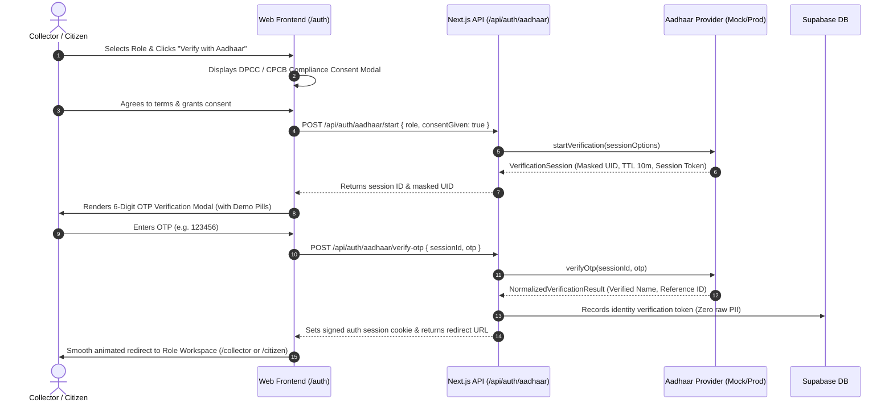

# SmartScrapSetu (스마트 스크랩 세투)

> **Decentralized Circular Economy Infrastructure**: Bridging informal waste collectors, citizens, and DPCC/CPCB-authorized recyclers through Aadhaar identity verification, 18 Indian regional languages, AI material grading, and end-to-end cryptographic traceability.

[](https://nextjs.org/)
[](https://react.dev/)
[](https://www.typescriptlang.org/)
[](https://supabase.com/)
[](https://uidai.gov.in/)
[](https://en.wikipedia.org/wiki/Languages_of_India)
[](https://vercel.com/)

---

## 1. Architectural Overview

SmartScrapSetu is structured as a resilient Next.js 16 (App Router) digital infrastructure designed for field collectors, urban citizens, formal recycling facilities, and compliance auditors.

```mermaid
flowchart TB
    subgraph ClientLayer["Client & Field Layer"]
        CitizenPortal["Citizen Portal (/citizen)"]
        CollectorPortal["Collector Portal (/collector)"]
        RecyclerHub["Recycler Facility Hub (/recycler)"]
        AdminConsole["Regulatory Console (/admin)"]
        AadhaarModal["Aadhaar Consent & OTP Modals"]
        LangSwitcher["18-Language Indic Switcher"]
    end

    subgraph AppEngine["Next.js 16 Application Engine"]
        AppShell["Role-Aware Navigation & Layout Shell"]
        
        subgraph AuthSystem["Identity & Verification Subsystem"]
            AadhaarRoutes["/api/auth/aadhaar/*<br/>(start, verify-otp, status, callback)"]
            ProviderFactory["Aadhaar Provider Factory"]
            MockProvider["Mock Provider (Demo Mode)"]
            ProdProvider["Production Gateway Connector"]
            GoogleFallback["Modular Google OAuth Drawer"]
        end

        subgraph LocalizationSystem["18-Language Multilingual Engine"]
            LocaleRegistry["Indic Registry (18 Languages)"]
            RegionalDict["Universal UI Regional Dictionary"]
            LegacyDict["Devanagari Legacy Maps"]
            TranslationResolver["Unified translateKey() Resolver"]
        end

        subgraph CoreWorkspaces["Domain Workspaces & Pipelines"]
            IntakeEngine["8-Category Scrap Scanner & AI Inferences"]
            PriceBoard["Delhi Benchmark Price Board"]
            ScheduleEngine["Doorstep Pickup Scheduler"]
            HandoverEngine["Cryptographic QR Handover & EPR Manifests"]
        end
    end

    subgraph DataServices["Data & External Services"]
        SupabaseDB[("Supabase PostgreSQL / RLS")]
        GeminiVision["Gemini 2.5 Flash Multimodal Vision API"]
        StorageBuckets[("Supabase Storage (Lots, Manifests)")]
    end

    CitizenPortal & CollectorPortal & RecyclerHub & AdminConsole --> AppShell
    AppShell --> LangSwitcher
    LangSwitcher --> TranslationResolver
    TranslationResolver --> RegionalDict & LocaleRegistry & LegacyDict

    AadhaarModal --> AadhaarRoutes
    AadhaarRoutes --> ProviderFactory
    ProviderFactory --> MockProvider & ProdProvider
    AadhaarRoutes -. Session Cookie .-> AppShell

    CollectorPortal --> IntakeEngine
    IntakeEngine -. Visual Diagnosis .-> GeminiVision
    IntakeEngine & HandoverEngine --> SupabaseDB & StorageBuckets
```



---

## 2. Core Workspaces & Key Capabilities

| Workspace | Target Audience | Primary Features |
|---|---|---|
| **Citizen** | Households, Offices, Housing Societies | Price estimation across 8 material streams, doorstep pickup scheduling, collector tracking, and estimated carbon diversion stats. |
| **Collector** | Informal Waste Collectors, Scrap Aggregators | 8-Category AI Scrap Scanner, scale weight input, DPCC ward cluster matching, collection schedules, earnings analytics, and field worker safety SOPs. |
| **Recycler** | CPCB / DPCC Authorized Recyclers | Incoming feedstock lot matching, custom rate-card publishing, facility overview, and QR cryptographic handover receipt verification. |
| **Administrator** | Regulators, Urban Local Bodies, Auditors | Authorized facility registry, immutable chain of custody manifests (SHA-256), verification queues, and EPR compliance telemetry export. |

---

## 3. Aadhaar-Based Identity Verification Flow

SmartScrapSetu replaces basic social login with a regulatory-compliant **Aadhaar identity verification system** built on strict **data minimization** principles:



### Security & Privacy Guarantees
- **Data Minimization**: Never stores or logs raw 12-digit Aadhaar numbers or OTPs.
- **Reference Tokens**: Stores only synthetic reference IDs and masked identities (e.g., `XXXX-XXXX-9842`).
- **Provider Abstraction**: Decoupled interface (`AadhaarProviderInterface`) allowing hot-swapping between `MockAadhaarProvider` (for testing) and `ProductionAadhaarProvider` via `AADHAAR_PROVIDER` env variable.
- **Backward Compatibility**: Preserves Google OAuth in a collapsible secondary drawer.

---

## 4. 18-Language Indian Multilingual System

The platform features an Indic multilingual engine covering **18 constitutional and widely spoken Indian languages**:

| Code | Language | Native Script Name | Direction | Script Support |
|---|---|---|---|---|
| `en` | English | English | LTR | Latin Standard |
| `hi` | Hindi | हिन्दी | LTR | Devanagari |
| `mr` | Marathi | मराठी | LTR | Devanagari |
| `bn` | Bengali | বাংলা | LTR | Bengali-Assamese |
| `te` | Telugu | తెలుగు | LTR | Telugu |
| `ta` | Tamil | தமிழ் | LTR | Tamil |
| `gu` | Gujarati | ગુજરાતી | LTR | Gujarati |
| `kn` | Kannada | ಕನ್ನಡ | LTR | Kannada |
| `ml` | Malayalam | മലയാളം | LTR | Malayalam |
| `pa` | Punjabi | ਪੰਜਾਬੀ | LTR | Gurmukhi |
| `or` | Odia | ଓଡ଼ିଆ | LTR | Odia |
| `as` | Assamese | অসমীয়া | LTR | Bengali-Assamese |
| `ur` | Urdu | اردو | LTR | Perso-Arabic (Nastaliq) |
| `mai` | Maithili | मैथिली | LTR | Devanagari |
| `ne` | Nepali | नेपाली | LTR | Devanagari |
| `kok` | Konkani | कोंकणी | LTR | Devanagari |
| `sd` | Sindhi | سنڌي | LTR | Perso-Arabic (Sindhi) |
| `dog` | Dogri | डोगरी | LTR | Devanagari |

### Key Localization Highlights:
1. **Uniform Left-Alignment**: All 18 language options in the dropdown menu start consistently on the left side with native names, English labels, and active checkmarks.
2. **Standard LTR Flow**: Layout remains in standard LTR flow across all languages (including Urdu and Sindhi) to maintain consistent field UX.
3. **Universal UI Dictionary (`regional-dictionary.ts`)**: Comprehensive translation map translating every core portal component into the selected regional language.
4. **Indic Typography Fallbacks**: High-legibility font stacks in `globals.css` including `Noto Sans Devanagari`, `Nirmala UI`, `Noto Sans Gurmukhi`, `Noto Sans Tamil`, `Noto Sans Telugu`, and `Noto Nastaliq Urdu`.
5. **Dual Persistence**: Preferences are stored in both `localStorage` and `NEXT_LOCALE` cookie for server-side localization rendering.

---

## 5. Standard 8 Material Categories

SmartScrapSetu standardizes informal scrap sorting into 8 verified CPCB/DPCC material streams:

1. **Plastic (PET / HDPE)** — Bottles, containers, hard plastics (~₹28/kg)
2. **Glass Bottles & Cullet** — Soda glass, beer bottles, broken cullet (~₹12/kg)
3. **Paper & Cardboard (OCC)** — Old corrugated cardboard, office waste, kraft (~₹18/kg)
4. **Metal — Ferrous (Iron & Steel)** — Rebar, scrap sheet, structural iron (~₹38/kg)
5. **Metal — Non-Ferrous (Copper / Brass)** — Pure copper busbars, heavy brass, aluminum (~₹420/kg)
6. **E-Waste & Circuit Boards** — High-grade motherboards, populated PCBs, telecom cards (~₹280/kg)
7. **Textile / Cloth Fabrics** — Industrial textile cuttings, cotton synthetic scrap (~₹16/kg)
8. **Rubber & Other (Tyres)** — Commercial vehicle tyres, vulcanized crumb scrap (~₹14/kg)

---

## 6. Repository Structure

```text
smart-scrap-v2/
├── app/                                 # Next.js 16 App Router pages and layouts
│   ├── api/auth/aadhaar/                # Aadhaar identity verification API endpoints
│   │   ├── start/route.ts               # POST: Enforce consent & start verification session
│   │   ├── verify-otp/route.ts          # POST: Validate OTP & issue auth session cookie
│   │   ├── status/[id]/route.ts         # GET: Poll sanitized verification status
│   │   └── callback/route.ts            # POST: Webhook receiver for verification callbacks
│   ├── auth/page.tsx                    # Identity verification & sign-in page
│   ├── citizen/page.tsx                 # Citizen portal entry
│   ├── collector/page.tsx               # Collector operations portal
│   ├── recycler/page.tsx                # Recycler facility hub
│   ├── globals.css                      # Global design tokens, typography, and scrollbars
│   └── layout.tsx                       # Root layout wrapping LanguageProvider
├── components/
│   ├── auth/                            # Aadhaar consent modal, OTP modal, AuthPage
│   ├── language/                        # Accessible 18-language switcher & context
│   ├── shell/                           # Header, AppShell, notifications, and profile pills
│   ├── collector/                       # Collector workspace components
│   ├── citizen/                         # Citizen workspace components
│   └── recycler/                        # Recycler facility components
├── features/
│   ├── collector/                       # AI Scrap Scanner, schedule, earnings analytics
│   ├── customer-pickup/                 # Doorstep pickup booking flow
│   ├── price-board/                     # Delhi 7-day rolling benchmark price board
│   ├── recycler/                        # Matched lots queue, rate card manager
│   ├── handover/                        # Cryptographic QR code handovers & traceability
│   └── safety/                          # Worker safety guidance & CPCB hazard SOPs
├── lib/
│   ├── auth/aadhaar/                    # Aadhaar provider abstraction (mock & production)
│   ├── language/locales/                # 18 language locale schemas, registry, regional-dict
│   ├── mock-data.ts                     # Pre-seeded demo lots, price boards, recyclers
│   └── supabase.ts                      # Supabase client connector
├── supabase/migrations/                 # Declarative PostgreSQL schema migrations
│   ├── 20260908184000_core_schema.sql   # Core platform tables (lots, matches, rate cards)
│   └── 20260909000000_identity_verification.sql # Identity verification token registry & RLS
├── main/                                # Synchronized mirror packages
│   ├── api/                             # Python FastAPI / Gemini background services
│   └── web/                             # Synced web source mirror
├── package.json
└── tsconfig.json
```

---

## 7. Getting Started

### Prerequisites
- **Node.js**: v20 or later
- **npm**: v10 or later

### Installation & Local Run

```bash
# 1. Clone the repository
git clone https://github.com/Yash3211/smart-scrap-v2.git
cd smart-scrap-v2

# 2. Checkout the backend branch
git checkout backend

# 3. Install dependencies
npm install

# 4. Copy environment configuration
cp .env.example .env.local

# 5. Run development server
npm run dev
```

Open **[http://localhost:3000](http://localhost:3000)** in your browser.

### Testing Identity Verification (Demo Mode)
1. Navigate to **[http://localhost:3000/auth](http://localhost:3000/auth)**.
2. Select your role (**Collector** or **Citizen**).
3. Click **"Verify with Aadhaar"**.
4. Review the CPCB compliance consent notice and click **"I Agree & Proceed"**.
5. When the OTP modal appears:
   - Click the **`123456 (Success)`** pill to autofill a valid demo OTP.
   - Click **"Submit OTP & Verify"**.
   - You will be authenticated and redirected to your workspace.

---

## 8. Environment Variables Reference

```dotenv
# Supabase Configuration
NEXT_PUBLIC_SUPABASE_URL=https://your-project.supabase.co
NEXT_PUBLIC_SUPABASE_ANON_KEY=your-anon-key
SUPABASE_SERVICE_ROLE_KEY=your-service-role-key

# Aadhaar Verification Provider ('mock' or 'production')
AADHAAR_PROVIDER=mock
AADHAAR_API_BASE_URL=https://api.gateway.gov.in/aadhaar
AADHAAR_CLIENT_ID=your-aadhaar-client-id
AADHAAR_CLIENT_SECRET=your-aadhaar-client-secret

# AI Vision Inspection (Optional)
GEMINI_API_KEY=your-gemini-api-key

# Application Settings
NEXT_PUBLIC_APP_URL=http://localhost:3000
```

---

## 9. Verification & Code Quality

```bash
# Run strict TypeScript validation
npx tsc --noEmit

# Run production build validation
npm run build
```

---

## 10. License & Compliance

Developed under the **Digital India Circular Economy Initiative** for responsible scrap valorization, worker formalization, and transparent e-waste traceability.
