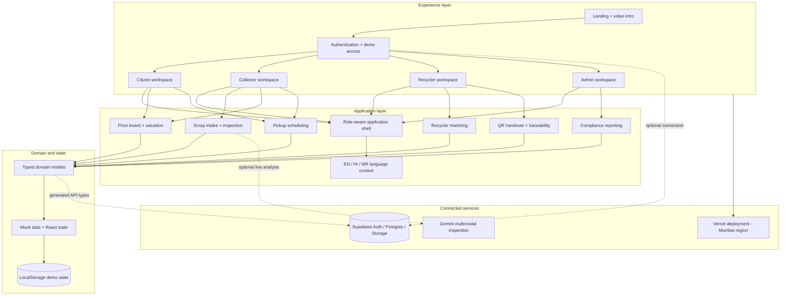
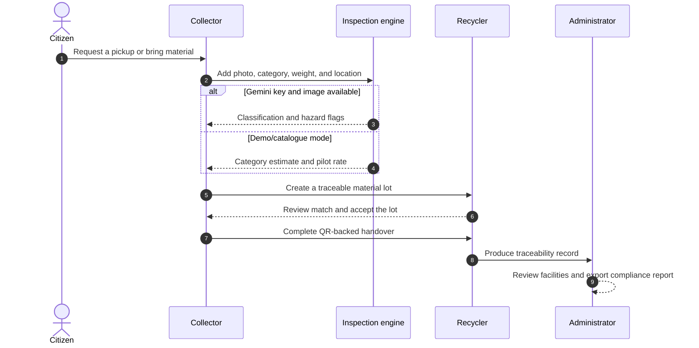
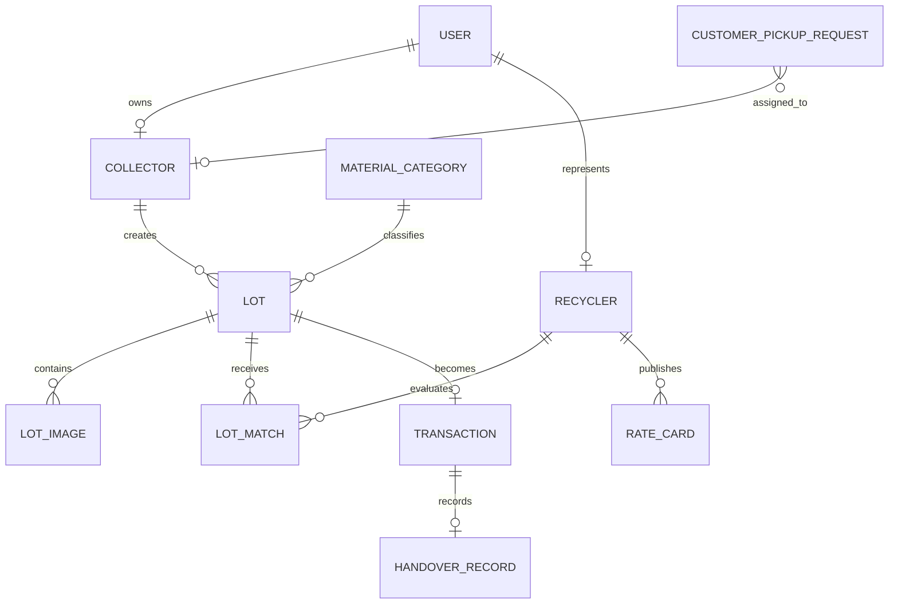

# SmartScrapSetu

> A digital bridge between citizens, local scrap collectors, authorized recyclers, and circular-economy administrators.

[](https://nextjs.org/)
[](https://react.dev/)
[](https://www.typescriptlang.org/)
[](https://supabase.com/)
[](https://vercel.com/)

SmartScrapSetu turns fragmented scrap collection into a visible, guided workflow. Citizens can estimate material value and request pickups, collectors can inspect and aggregate scrap, recyclers can manage incoming lots and handovers, and administrators can review facilities and export compliance records.

The current application is designed as a Delhi NCR pilot. It runs immediately with local demo data and can connect to Supabase for authentication and storage.

## What the platform offers

| Workspace | Primary capabilities |
| --- | --- |
| **Citizen** | Material price estimation, doorstep pickup requests, and browser-based demo tracking |
| **Collector** | Photo-assisted identification, weight and location capture, price guidance, collection scheduling, earnings analytics, safety guidance, and lot creation |
| **Recycler** | Incoming lot matching, rate-card management, facility overview, QR handover verification, and traceability records |
| **Administrator** | Facility verification, network oversight, compliance manifests, role boundaries, and CSV report export |

Additional experience features include English, Hindi, and Marathi content; responsive role-aware navigation; voice-assisted input where supported; an offline-outbox simulation; and a cinematic landing-page intro.

## Architecture



### Material journey



## Application routes

| Route | Experience |
| --- | --- |
| `/` | Public landing page and material-cycle introduction |
| `/auth` | Sign in, sign up, Google OAuth entry point, and demo personas |
| `/citizen` | Price estimator and pickup booking |
| `/collector` | Inspection, schedules, earnings, and safety tools |
| `/recycler` | Matched lots, rates, facility overview, and handovers |
| `/admin` | Facility governance and compliance console |

Protected workspaces validate the role stored for the current session and redirect users to the appropriate experience.

## Repository structure

```text
smart-scrap-v2/
├── app/                         # Next.js routes and global presentation
├── components/
│   ├── landing/                 # Public site and video intro
│   ├── auth/                    # Authentication and demo access
│   ├── citizen/                 # Citizen workspace composition
│   ├── collector/               # Collector workspace composition
│   ├── recycler/                # Recycler workspace composition
│   ├── admin/                   # Governance workspace composition
│   ├── shell/                   # Shared role-aware navigation
│   ├── language/                # Translation context and switcher
│   └── ui/                      # Reusable interface primitives
├── features/
│   ├── collector/               # Inspection, scheduling, and earnings
│   ├── customer-pickup/         # Pickup request workflow
│   ├── price-board/             # Indicative material pricing
│   ├── recycler/                # Lot queue, overview, and rate cards
│   ├── handover/                # Verification and chain of custody
│   ├── pickups/                 # Shared citizen/collector requests
│   └── safety/                  # Hazard handling guidance
├── lib/                         # Services, dictionaries, and demo data
├── types/                       # Generated schema and domain models
├── scripts/                     # Supabase setup helpers
└── public/                      # Images and intro video
```

## Technology stack

| Layer | Technology |
| --- | --- |
| Web framework | Next.js 16 App Router |
| UI runtime | React 19 and TypeScript |
| Styling | Scoped CSS Modules and global design tokens |
| Icons | Lucide React |
| Motion | CSS transitions, route animation, video intro, and Lenis scrolling |
| Authentication and data | Supabase client with a local demo fallback |
| AI inspection | Optional Gemini 2.5 Flash multimodal analysis with catalogue fallback |
| Localization | English, Hindi, and Marathi dictionary context |
| Hosting | Vercel in the Mumbai region (`bom1`) |

## Getting started

### Prerequisites

- Node.js 20+
- npm
- A modern browser

### Install and run

```bash
git clone https://github.com/Yash3211/smart-scrap-v2.git
cd smart-scrap-v2
npm install
cp .env.example .env.local
npm run dev
```

Open [http://localhost:3000](http://localhost:3000).

Supabase credentials are optional for the demo. Leave the placeholder values in place, open `/auth`, and choose a demo persona to explore each workspace.

## Environment configuration

```dotenv
NEXT_PUBLIC_SUPABASE_URL=https://your-project-ref.supabase.co
NEXT_PUBLIC_SUPABASE_ANON_KEY=your-supabase-anon-key

# Server-side scripts only. Never expose this value in browser code.
SUPABASE_SERVICE_ROLE_KEY=your-service-role-key

# Optional external collector service endpoint.
NEXT_PUBLIC_API_URL=http://localhost:8000

NEXT_PUBLIC_APP_URL=http://localhost:3000
```

### Runtime modes

| Mode | Behavior |
| --- | --- |
| **Demo** | Uses typed mock data, React state, and browser storage. No real pickup or payment is created. |
| **Supabase-connected** | Enables Supabase authentication and prepares project-backed data and storage. |
| **Live inspection** | A Gemini key and uploaded image enable multimodal classification; otherwise the scanner returns a catalogue estimate. |

## Core domain model



Primary concepts include users, collectors, recyclers, material categories, lots, recycler matches, rate cards, transactions, pickup requests, handover records, safety content, and Delhi wards.

## Useful commands

| Command | Purpose |
| --- | --- |
| `npm run dev` | Start the development server |
| `npm run build` | Create an optimized production build |
| `npm start` | Run the production build |
| `npm run update-types` | Regenerate Supabase-linked TypeScript definitions |
| `node scripts/setup-storage-buckets.js` | Configure the required Supabase storage buckets |

The storage script creates buckets for lot images, handover photos, pickup photos, and safety media. It requires `SUPABASE_SERVICE_ROLE_KEY` and should only run in a trusted environment.

## Design principles

- **Role clarity:** each participant sees tools relevant to their place in the material journey.
- **Traceability:** lots, matches, transactions, and handovers form a visible chain of custody.
- **Accessible guidance:** multilingual content, safety instructions, speech input, and responsive layouts support field use.
- **Graceful fallback:** the product remains explorable when connected services are unavailable.
- **Typed boundaries:** generated API definitions and domain models keep data contracts explicit.

## Deployment

The repository includes `vercel.json` with the Mumbai deployment region configured.

1. Import the repository into Vercel.
2. Add the required environment variables.
3. Deploy using the standard Next.js build command.
4. Add Supabase redirect URLs for the production domain if OAuth is enabled.

## Project status

SmartScrapSetu currently combines production-ready interface architecture with demo-first workflows. Authentication can connect to Supabase, while most operational records use typed mock data or browser-local state. Replace those adapters with persistent service calls as the pilot moves toward live operations.

## Contributing

1. Create a focused branch from `main`.
2. Keep role boundaries and shared domain models intact.
3. Run `npx tsc --noEmit` and `npm run build` before opening a pull request.
4. Document new environment variables and workflow changes here.

---

Built for a circular economy where every material keeps moving forward.
